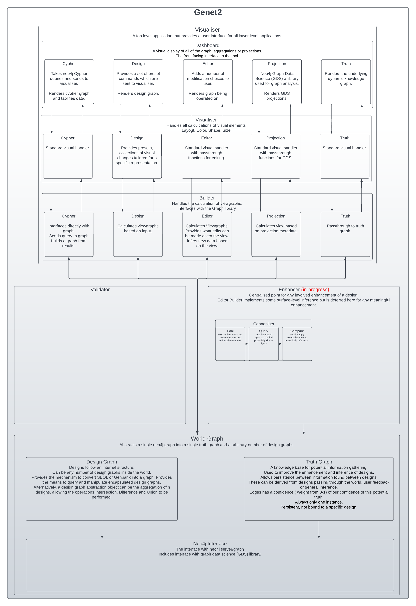

# Genet

Genet is a tool to represent genetic designs as networks. A network-centric approach provides several advantages, namely representing and analysing complex systems.

Furthermore, knowledge graphs have been widely used in biological sciences and are used here as the basis for structuring input data. The addition of semantics allows for more complex control over the underlying data, e.g., the ability to arrange information into several layers of abstraction.

Genet currently aims to visualise genetic data as a network; we expand this to allow network-centric analysis primarily around enhancement and validation.

A solid understanding of software management is required to use Genet because a neo4j server is required to use this. Genet's public service is currently unavailable because network analysis can be expensive. We are working on making this process simpler by providing a docker container. A simpler version of this tool that does not require neo4j can be found here: https://github.com/intbio-ncl/net_vis_syn_bio.

Please get in touch with us if you would like to contribute or if you would like to use the system (or sub-system) within your workflow.

## Installation

Genet requires a neo4j server active and running with the APOC, and GDS plugins enabled. Here is a brief guide to installing neo4j with links to more comprehensive installation guides. Note this guide assumes a Debian based operating system.
* `$ git clone https://github.com/intbio-ncl/genet2`
*  Install Neo4j (https://neo4j.com/docs/operations-manual/current/installation/)
	1. `$ wget -O - https://debian.neo4j.com/neotechnology.gpg.key | sudo apt-key add -`
	2. `$ echo 'deb https://debian.neo4j.com stable latest' | sudo tee -a /etc/apt/sources.list.d/neo4j.list`
	3. `$ sudo apt-get update`
	4. `$ sudo apt-get install neo4j=1:4.4.6`
* Enable APOC (https://neo4j.com/labs/apoc/4.1/installation/)
	1. `$ mv NEO4J_HOME/labs/apoc-4.4.0.3-core.jar $NEO4J_HOME/plugins` (usually `mv /var/lib/neo4j/labs/apoc-4.4.0.3-core.jar /var/lib/neo4j/plugins`).
	2. `$ sudo neo4j restart`
* Install GDS (https://neo4j.com/docs/graph-data-science/current/installation/neo4j-server/)
	1. Download 'neo4j-graph-data-science-[version].jar' from the [Neo4j Download Center](https://neo4j.com/download-center/#algorithms)
	2. Copy it into the `$NEO4J_HOME/plugins` directory (usually `/var/lib/neo4j/plugins`).
	3. Add `dbms.security.procedures.unrestricted=gds.*` and `dbms.security.procedures.allowlist=gds.*` to `$NEO4J_HOME/conf/neo4j.conf` (usually `/var/lib/neo4j/conf/neo4j.conf`).
	4. `$ sudo neo4j restart`
* Install Python requirements.
	1. Navigate to your install directory
	2. `python -m pip install -r requirements.txt`
## Usage

1.  Navigate to your install directory
2.  $ FLASK_APP=router.py python3 -m flask run
3.  Open a browser and enter: http://127.0.0.1:5000/
4.  The landing page has information for using the tool.

## Architecture

As discussed, Genet uses neo4j for graph storage and manipulation. However, to present this, a small flask application using dash-Cytoscape has been implemented and enables the user-generated network visualisations. A graphic of the architecture can be seen below.

